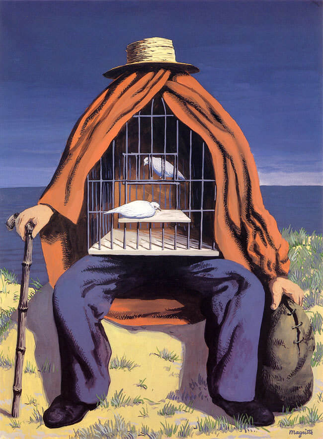
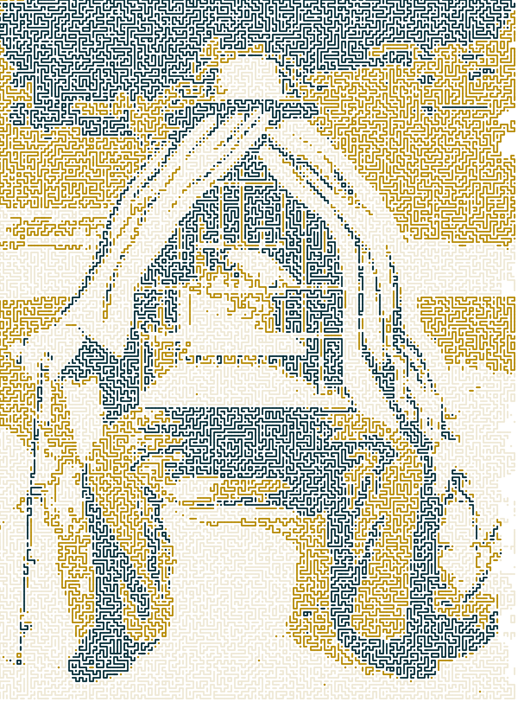

I was inspired by the game "Snake" on Nokia mobile phone and made this a jpg image filter. It passes an input image named "input_img.jpg", and returns "output_img.png". There is an example result using Rene Magritte's "The Therapist" as the input:
 

